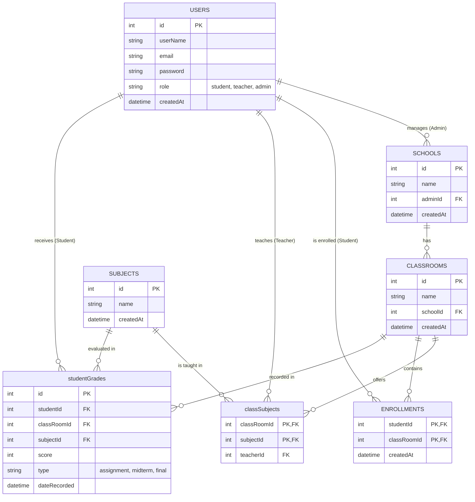

# School Management API

## 1. Project Overview

This is a robust and high-performance **School Management System API** built with modern web technologies. It allows for the comprehensive management of educational structures, including schools, classrooms, subjects, teachers, students, and grades.

### Technology Stack
*   **Framework:** [Hono](https://hono.dev/) - A small, fast, and ultrafast web framework for the Edges.
*   **Database:** [Cloudflare D1](https://developers.cloudflare.com/d1/) - Serverless SQL database.
*   **ORM:** [Drizzle ORM](https://orm.drizzle.team/) - Lightweight and type-safe TypeScript ORM.
*   **Language:** [TypeScript](https://www.typescriptlang.org/) - Typed superset of JavaScript.
*   **Authentication:** JWT (JSON Web Tokens) & bcryptjs for secure password hashing.
*   **Deployment:** Cloudflare Workers.

---

## 2. Architecture Design

The database schema is designed to support a multi-tenant-like structure where **Admins** manage **Schools**, and **Schools** contain **ClassRooms**. **Subjects** are linked to **ClassRooms** via **Teachers**. **Students** are enrolled in **ClassRooms** and receive **Grades**.



---

## 3. API Documentation

Authentication uses **Bearer Token**. Most management routes require the user to have the `admin` role.

### A. Client/Admin Interface

These endpoints are used for day-to-day operations of the school management system.

#### **Users & Authentication**

| Method | Route | Auth | Description |
| :--- | :--- | :--- | :--- |
| `POST` | `/users/signup` | Public | Register a new user (`student`, `teacher`, `admin`). |
| `POST` | `/users/login` | Public | Login and retrieve a JWT token. |
| `DELETE` | `/users/delete/:id` | **Admin** | Delete a user (cannot delete Admins). |
| `GET` | `/users/admin/profile` | **Auth** | Get current logged-in user profile. |
| `GET` | `/users/admin/teachers` | **Admin** | Get all teachers in schools managed by the admin. |
| `GET` | `/users/admin/teacher/:id` | **Admin** | Get a specific teacher's details. |
| `GET` | `/users/admin/students/:classRoomId` | **Admin** | Get all students in a specific class. |
| `GET` | `/users/admin/student/:id` | **Admin** | Get a specific student's details including grades. |

#### **Schools**

| Method | Route | Auth | Description |
| :--- | :--- | :--- | :--- |
| `POST` | `/schools` | **Admin** | Create a new school. |
| `GET` | `/schools` | Public | Get all schools. |
| `DELETE` | `/schools/:id` | **Admin** | Delete a school. |

#### **Classes**

| Method | Route | Auth | Description |
| :--- | :--- | :--- | :--- |
| `POST` | `/classes` | **Admin** | Create a class in a school. |
| `GET` | `/classes` | **Admin** | Get all classes managed by the admin. |
| `GET` | `/classes/:id` | **Admin** | Get detailed info for a single class. |
| `DELETE` | `/classes/delete/:id` | **Admin** | Delete a class. |

#### **Subjects**

| Method | Route | Auth | Description |
| :--- | :--- | :--- | :--- |
| `POST` | `/subjects` | **Admin** | Create a global subject. |
| `GET` | `/subjects/admin/:classId` | **Admin** | Get subjects taught in a specific class. |
| `DELETE` | `/subjects/:id` | **Admin** | Delete a subject. |

#### **Connections & Enrollments**

| Method | Route | Auth | Description |
| :--- | :--- | :--- | :--- |
| `POST` | `/connections/connect` | **Admin** | Assign a Teacher and Subject to a Class. |
| `DELETE` | `/connections/disconnect` | **Admin** | Remove a Teacher/Subject link from a Class. |
| `GET` | `/connections/all` | **Auth** | List all Class-Subject-Teacher connections. |
| `POST` | `/enrollments/enroll` | **Admin** | Enroll a Student in a Class. |
| `GET` | `/enrollments/all` | **Admin** | List all enrollments. |

#### **Grades**

| Method | Route | Auth | Description |
| :--- | :--- | :--- | :--- |
| `POST` | `/grades` | **Admin** | Record a grade for a student. |
| `GET` | `/grades` | Public | List all grades. |
| `PUT` | `/grades/:id` | **Admin** | Update an existing grade. |
| `DELETE` | `/grades/:id` | **Admin** | Delete a grade record. |

### B. Developer/System Interface

These endpoints are for debugging, system verification, and data populating.

| Method | Route | Auth | Description |
| :--- | :--- | :--- | :--- |
| `POST` | `/seed` | Public | **Reset and Seed** the database with realistic fake data. |
| `GET` | `/dev/classes` | **Dev** | Get raw dump of all classes. |
| `GET` | `/dev/users` | **Dev** | Get raw dump of all users. |
| `GET` | `/dev/users/students` | **Dev** | Get raw dump of all students. |
| `GET` | `/dev/users/teachers` | **Dev** | Get raw dump of all teachers. |
| `GET` | `/dev/users/admin` | **Dev** | Get raw dump of all admins. |

---

## 4. Endpoint Details (Examples)

### **Login**
*   **Route:** `POST /users/login`
*   **Input:**
    ```json
    {
      "email": "admin@example.com",
      "password": "hashed_password"
    }
    ```
*   **Success (200):**
    ```json
    {
      "user": { "id": 1, "userName": "Admin", "role": "admin", ... },
      "token": "eyJhbGciOiJIUzI1NiJ9..."
    }
    ```

### **Create Class**
*   **Route:** `POST /classes`
*   **Auth:** Admin Token
*   **Input:**
    ```json
    {
      "name": "Class 1A",
      "schoolId": 1
    }
    ```
*   **Success (201):**
    ```json
    {
      "id": 10,
      "name": "Class 1A",
      "schoolId": 1,
      "createdAt": "..."
    }
    ```
*   **Error (404):** `{"error": "School not found"}`

### **Assign Teacher to Subject in Class**
*   **Route:** `POST /connections/connect`
*   **Auth:** Admin Token
*   **Input:**
    ```json
    {
      "classRoomId": 10,
      "subjectId": 5,
      "teacherId": 2
    }
    ```

---

## 5. Interactive Testing

You can easily test the API using the provided `data.http` file with the **REST Client** extension for VS Code.

1.  **Open `data.http`**.
2.  **Seed the Database:** Send the `POST {{baseUrl}}/seed` request first to populate data.
3.  **Login:** Send the `POST /users/login` request to get a token.
4.  **Update Variable:** Copy the token from the response and update the `@adminToken` variable at the top of the file.
5.  **Run Requests:** Click "Send Request" above any endpoint to test it.

Example `curl` for verification:
```bash
curl -X GET http://localhost:8787/schools
```

---

## 6. Setup & Installation

### Prerequisites
*   Node.js (v18+)
*   npm

### Installation Steps

1.  **Clone the Repository**
    ```bash
    git clone https://github.com/your-repo/school-management-api.git
    cd school-management-api
    ```

2.  **Install Dependencies**
    ```bash
    npm install
    ```

3.  **Configure Environment**
    Create a `.dev.vars` file in the root directory:
    ```env
    JWT_SECRET="your_super_secret_key"
    ```

4.  **Database Migration (Local)**
    Initialize the local D1 database:
    ```bash
    npx wrangler d1 migrations execute myAppD1 --local
    ```

5.  **Run Development Server**
    ```bash
    npm run dev
    ```
    The server will start at `http://localhost:8787`.

6.  **Seed Data**
    Post to `/seed` to populate your local database:
    ```bash
    curl -X POST http://localhost:8787/seed
    ```
